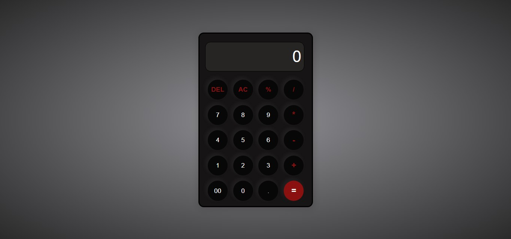

[Calculator](#Calculator)
[Overview](#Overview)
[Screenshot](#Screenshot)
[link](#Link)
[Author](#Author)

# Overview 
A simple design of a calculator, using HTML, CSS and JS

# Screenshot

# Link
Live site Url- [Calculator-by Utibe](https://utibecode.github.io/Calculator/)

# Author
frontendmentor - [@Utibe](https://www.frontendmentor.io/profile/UtibeCode)
Git - [@UtibeCode](https://github.com/UtibeCode)
dev.to - [@utibe](https://dev.to/utibe)
